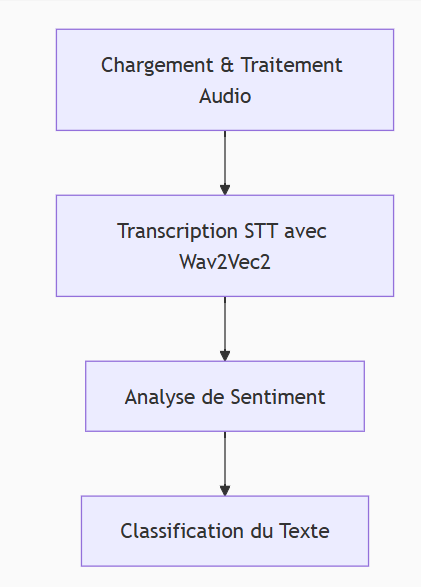
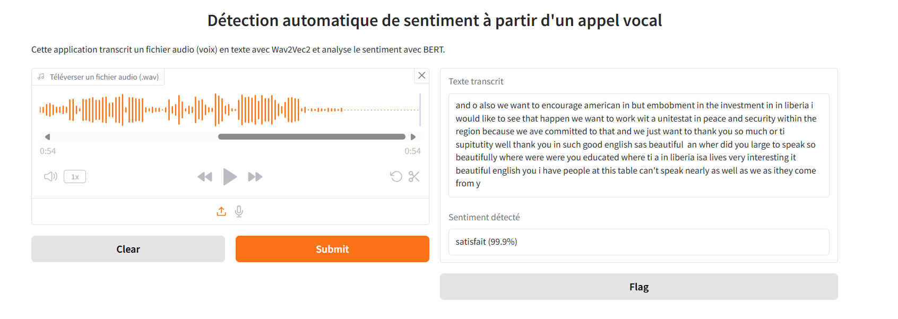

# Examen_DeepLearning_2
## Projet : Détection Automatique de Sentiment dans des Appels Vocaux à l’aide de Wav2Vec 2.0 et BERT

### 1. Contexte

les constants faites dans les mileux des entreprises de communications ou sociétés de communications, ils (ou elles) reçoivent quotidiennement des appels vocaux de clients. Ces appels contiennent des informations précieuses sur la satisfaction, les frustrations ou les attentes des clients. ces mêmes constats a été faites en Republique Démocratique du Congo, plusieurs sociétés de communications comme **Vodacom**, **Airtel**, **Orange** et **Africell**,ont fait le même constats. Cependant, analyser manuellement des milliers d’heures d’enregistrements est coûteux
et inefficace pour ces entreprises car ils doivents prendre des décisions rapidement sur retours de cleints sur les services offerts afin de fidéliser les clients.

L’objectif de ce projet est de développer un pipeline automatisé qui :

1. Transcrit des fichiers audio (voix) en texte.
2. Analyse le sentiment du texte pour détecter si le client est satisfait, mécontent ou neutre.

### 2. Architecture du projet

Voici l'architecture que nous devrions implementer : 

cette Architecture suit les étapes ci-après : 
il  a été demandé de mettre en place un pipeline **pipeline global** qui suit les étapes :

1. Chargement et traitement des fichiers audio ;
2.  Transcription vocale en texte via un modèle de Speech-to-Text ;
3.  Analyse de sentiment à partir du texte via un modèle NLP ;
4.  Classification de la transcription. Schématiquement, nous avons suivi : 

### les étapes poursuivis

## Analyse de Sentiment dans les Appels Vocaux

Ce projet que nous venons d'emplementer nous a permis d'effectuer la transcription automatique d'appels vocaux en texte à l'aide de Wav2Vec 2.0, et d'analyser ensuite le sentiment (**positif**, **negatif** ou **neutre**) avec **DistilBERT**. Une interface utilisateur est disponible via Gradio, ainsi qu'une API REST construite avec FastAPI.

## ARCHITECTURE

## Technologies utilisées

Pour atteindre notre objectif, nous avions fait recours aux modèles et technoologies suivants :

1. Wav2Vec2 pour la transcription audio (speech-to-text)
2. DistilBERT pour l'analyse de sentiment
3. Gradio pour l'interface utilisateur
4. FastAPI pour l'API REST

**a) Installation & Configuration**

pour la gestion et le contrôle de notre projet, nous avions utilisé la platefome en ligne qui utilise git, github nous acréer un repositoiries et nous avions cloné en local, pour une bonne communication soit un dépot en ligne et l'autre en local.

nous avons installé les dépendances 
**pip install -r requirements.txt

## Lancement de l'application

**1. Interface Gradio (interface web simple)**
python app_gradio.py
Puis aller sur (http://127.0.0.1:7860)

**2. API REST avec FastAPI**
uvicorn app_fastAPI:app --reload
Accéder à la documentation interactive ici :
(http://127.0.0.1:8000/docs)

**Exemple de requête curl**
curl -X POST "http://127.0.0.1:8000/analyse/" -F "file=@chemin/vers/audio.wav"

## Cas d'usage

1. **Centres d'appels** : Analyse automatique du ressenti des clients dans les appels enregistrés.
2. **Systèmes vocaux intelligents** : Évaluation de la satisfaction ou frustration utilisateur.
3. **Études de marché** : Traitement d’interviews enregistrées pour extraire le sentiment.
4. **Éducation & Évaluation de la Lecture** : Grâce à la transcription et à l’analyse de sentiment, les enseignants peuvent évaluer le niveau de compréhension, d’intonation et d’expression des élèves dans une langue étrangère. Un élève qui lit une phrase avec émotion ou qui exprime une opinion pourra être évalué automatiquement sur la base du sentiment dégagé par sa lecture.
5. **Criminologie & Justice pénale** : L’analyse automatique du ton et du sentiment dans les propos audio de criminels ou détenus (lors d'interrogatoires ou entretiens) peut aider à détecter des indices émotionnels, du stress ou des changements d'attitude. Cela peut être utilisé pour l’évaluation du risque de récidive, la crédibilité des témoignages ou encore le suivi psychologique.
6. **Analyse parlementaire** : Analyse des discours des députés à l’Assemblée nationale pour mesurer le ton émotionnel autour d’un projet de loi. Permet d’identifier les tendances (favorable ou défavorable), les débats houleux, et de catégoriser automatiquement les interventions.
7. **Domaine religieux** : Analyse des sermons ou discours de pasteurs et prêtres pour détecter le ton émotionnel relatif à des sujets sensibles (ex. homosexualité, morale, etc.), dans le but de mesurer l’évolution du discours religieux ou de détecter d’éventuels propos discriminatoires.
8. **Musique engagée** : Analyse de paroles chantées pour détecter des sentiments révolutionnaires ou contestataires, permettant de surveiller des contenus politiquement sensibles dans des régimes autoritaires.
9. **Politique** : Analyse des discours publics ou débats pour détecter des sentiments xénophobes, haineux ou discriminatoires, afin de surveiller et comprendre les tendances sociopolitiques.
10. **Santé** : Analyse des entretiens ou consultations vocales pour identifier les attitudes et sentiments des adolescents concernant l'utilisation des méthodes contraceptives, facilitant ainsi les campagnes de sensibilisation adaptées.

## Réponse de l'application

### Les liens vers les modèles utilisés (hébergés sur Hugging Face ou autre plateforme).
pour [le modele ASR](https://huggingface.co/facebook/wav2vec2-base-960h) 
pour [le modele BERT](https://huggingface.co/distilbert/distilbert-base-uncased-finetuned-sst-2-english)
pour [wav2vec2.0] (https://huggingface.co/docs/transformers/model_doc/wav2vec2#fine-tuning-wav2vec2-for-automatic-speech-recognition)
pour [wav2vec2-bert] (https://huggingface.co/docs/transformers/model_doc/wav2vec2-bert)

### Nous avons exploité certains articles

ces articles sont tellements intéressants et nous continuerons de l'exploiter afin d'assoire les théories de bases sur le NLP. 

[WAV2VEC: UNSUPERVISED PRE-TRAINING FOR SPEECH RECOGNITION](artiles/bert/1904.05862v4.pdf)
[wav2vec 2.0: A Framework for Self-Supervised Learning of Speech Representations](artiles/bert/2006.11477v3.pdf)
[Multi-level Fusion of Wav2vec 2.0 and BERT for Multimodal Emotion Recognition](articles/bert/2207.04697v2.pdf)
[wav2vec 2.0: A Framework for Self-Supervised Learning of Speech Representations](articles/wav2vec/2006.11477v3.pdf)
[Emotion Recognition from Speech Using Wav2vec 2.0 Embeddings](articles/wav2vec/2104.03502v1.pdf)
[Utilisation de wav2vec 2.0 pour des tâches de classifications phonétiques : aspects méthodologiques](https://inria.hal.science/hal-04623074v1/file/4331.pdf)
[Reconnaissance des émotions vocales avec la version ajustée de Wav2vec 2.0/HuBERT](https://zaion.ai/reconnaissance-des-emotions-vocales-avec-la-version-ajustee-de-wav2vec-2-0-hubert/)
[Adaptation de modèles auto-supervisés pour la reconnaissance de phonèmes dans la parole d’enfant](https://inria.hal.science/hal-04623075v1/document)
[these : Exploitation de transcriptions bruitées pour la reconnaissance automatique de la parole](https://hal.univ-lorraine.fr/tel-03669875v1/file/DDOC_T_2022_0032_DUFRAUX.pdf)

## NOTE IMPORTANTE SUR LE MODELE WAV2VEC2:

- Lors du chargement, tu peux voir un avertissement indiquant que certains poids du modèle ne sont pas initialisés à partir du checkpoint pré-entraîné. Cela arrive car certaines parties du modèle sont ajoutées ou adaptées (comme le masked_spec_embed), et c’est normal.

- Ce modèle pré-entraîné fonctionne bien pour des tâches générales de transcription en anglais, mais la qualité de la transcription dépend beaucoup de la qualité et la clarté de l’audio.

- Pour des cas d’utilisation en production, il est recommandé d’adapter ou affiner (fine-tuner) le modèle avec des données spécifiques au domaine, à la langue, à l’accent ou au type d’enregistrements que tu vas traiter. Cela améliorera considérablement la précision et la robustesse du modèle.

